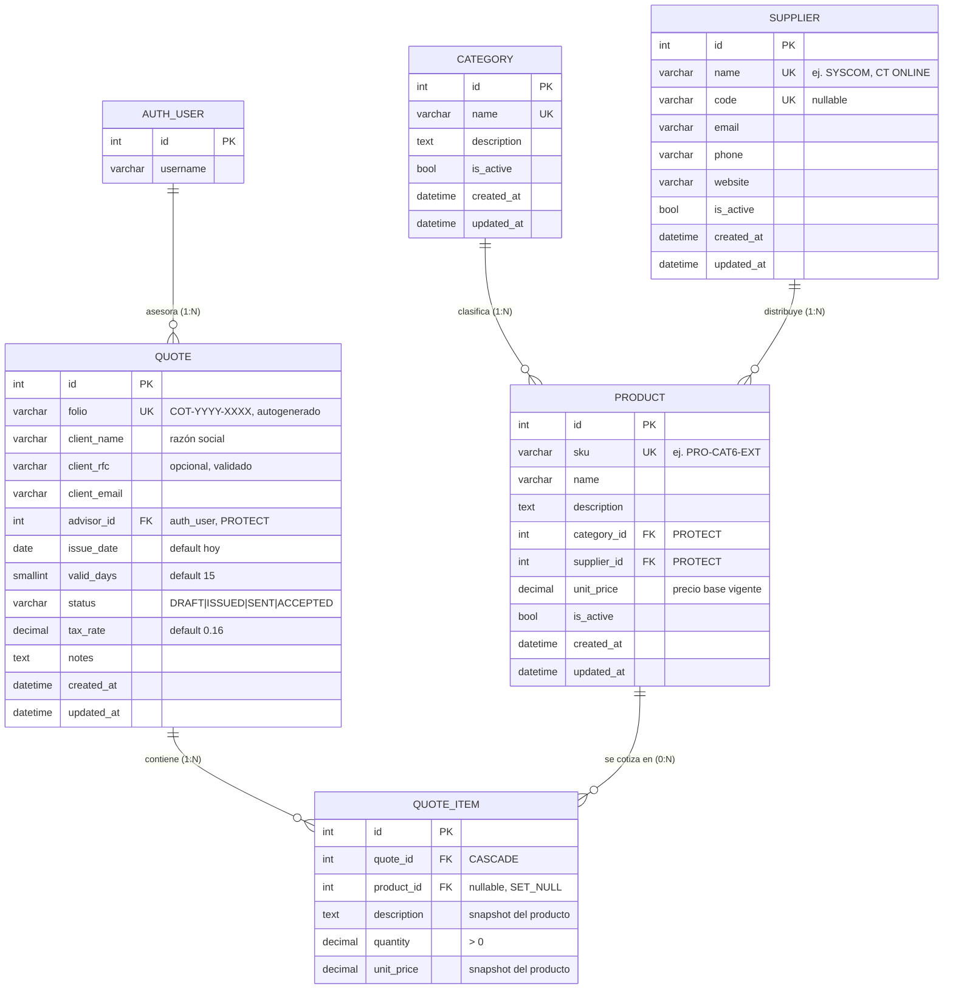

# DER — Catálogo y Cotizaciones (M1b)

Diagrama Entidad-Relación de las apps `catalog` y `quotes`.
Fuente de verdad: `apps/catalog/models.py` y `apps/quotes/models.py`.

## Diagrama (Mermaid)

> Las propiedades calculadas (`Quote.subtotal`, `Quote.tax`, `Quote.total`,
> `Quote.expiration_date`, `QuoteItem.amount`) **no son columnas** de la BD;
> se derivan en Python/SQL al consultarse.

## Diccionario de datos

### catalog_category — Clasificación de productos

| Campo | Tipo | Clave | Descripción |
|---|---|---|---|
| id | serial | PK | Identificador interno |
| name | varchar(100) | UK | Nombre de la categoría (ej. Cableado estructurado) |
| description | text | | Descripción opcional |
| is_active | bool | | Permite desactivar sin borrar |
| created_at / updated_at | timestamptz | | Auditoría automática |

### catalog_supplier — Marca o distribuidor

| Campo | Tipo | Clave | Descripción |
|---|---|---|---|
| id | serial | PK | Identificador interno |
| name | varchar(100) | UK | Nombre comercial (ej. SYSCOM, CT ONLINE) |
| code | varchar(20) | UK (nullable) | Clave/abreviatura interna |
| email / phone / website | varchar | | Datos de contacto opcionales |
| is_active | bool | | Permite desactivar sin borrar |
| created_at / updated_at | timestamptz | | Auditoría automática |

### catalog_product — Producto cotizable

| Campo | Tipo | Clave | Descripción |
|---|---|---|---|
| id | serial | PK | Identificador interno |
| sku | varchar(50) | UK | Código/clave único (ej. PRO-CAT6-EXT) |
| name | varchar(200) | | Nombre corto |
| description | text | | Descripción detallada para la cotización |
| category_id | int | FK → category | PROTECT: no se borra una categoría con productos |
| supplier_id | int | FK → supplier | PROTECT: idem para proveedor |
| unit_price | numeric(12,2) | | Precio unitario base vigente (≥ 0) |
| is_active | bool | | Permite desactivar sin borrar |
| created_at / updated_at | timestamptz | | Auditoría automática |

### quotes_quote — Cabecera de cotización

| Campo | Tipo | Clave | Descripción |
|---|---|---|---|
| id | serial | PK | Identificador interno |
| folio | varchar(20) | UK | Folio autogenerado COT-YYYY-XXXX (correlativo anual) |
| client_name | varchar(255) | | Razón social del cliente |
| client_rfc | varchar(13) | | RFC opcional, validado con regex oficial |
| client_email | varchar | | Correo del cliente (para envío) |
| advisor_id | int | FK → auth_user | Asesor técnico a cargo; PROTECT para preservar historial |
| issue_date | date | | Fecha de emisión (default: hoy) |
| valid_days | smallint | | Días de vigencia (default: 15) |
| status | varchar(10) | | DRAFT → ISSUED → SENT → ACCEPTED |
| tax_rate | numeric(5,4) | | Tasa de IVA de la cotización (default: 0.16) |
| notes | text | | Notas / condiciones comerciales |
| created_at / updated_at | timestamptz | | Auditoría automática |

### quotes_quoteitem — Partida de cotización

| Campo | Tipo | Clave | Descripción |
|---|---|---|---|
| id | serial | PK | Identificador interno |
| quote_id | int | FK → quote | CASCADE: se borra con su cotización |
| product_id | int | FK → product | Nullable; SET_NULL: la partida sobrevive si el producto se borra |
| description | text | | Snapshot de la descripción al cotizar (editable) |
| quantity | numeric(10,2) | | Cantidad (> 0; decimal para metros/piezas fraccionadas) |
| unit_price | numeric(12,2) | | Precio unitario congelado al momento de cotizar |

## Notas de diseño

- **Snapshot en partidas**: al guardar un `QuoteItem` ligado a un producto, si
  `description` o `unit_price` vienen vacíos se copian del catálogo. Así, un
  cambio de precio posterior en `Product` nunca altera cotizaciones emitidas.
- **Totales calculados, no persistidos**: `subtotal` se calcula con agregación
  SQL (`SUM(quantity × unit_price)`), `tax = subtotal × tax_rate` y
  `total = subtotal + tax`. Se evita desnormalización e inconsistencias.
- **Folio**: se genera en `Quote.save()` con formato `COT-YYYY-XXXX`
  (consecutivo que reinicia cada año). La unicidad la garantiza el constraint
  `unique`; ante colisión por concurrencia se reintenta el guardado.
- **Vigencia**: `expiration_date = issue_date + valid_days` (derivada) e
  `is_expired` para validar cotizaciones vencidas.
- **Borrado seguro**: `PROTECT` en `advisor`, `category` y `supplier`
  preserva la integridad del historial comercial.
- **Tablas físicas** (convención Django `app_modelo`): `catalog_category`,
  `catalog_supplier`, `catalog_product`, `quotes_quote`, `quotes_quoteitem`.
